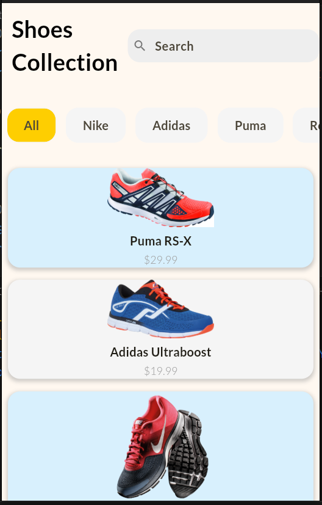
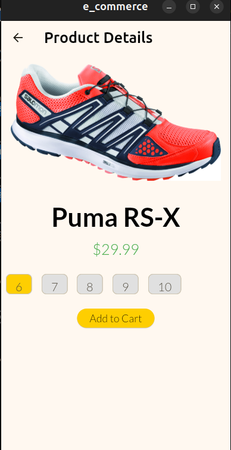
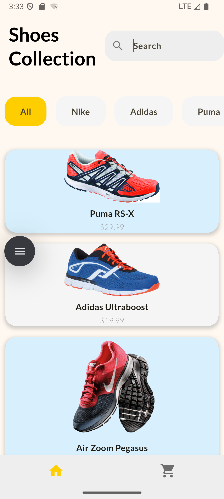

# E-Commerce App

An elegant and modern e-commerce app built with Flutter. This app showcases a collection of men's sneakers, allowing users to browse products, filter by brand, and view product details.

## Features

- **Product Listing**: Displays a list of sneakers with images, names, and prices.
- **Filter by Brand**: Users can filter products by brand (e.g., Nike, Adidas, Puma).
- **Search Functionality**: Search bar to quickly find products.
- **Responsive Design**: Optimized for various screen sizes.
- **Cart Management**: Add products to the cart for purchase.

## Screenshots





## Project Structure

lib/ ├── main.dart # Entry point of the app ├── home_page.dart # Home page with product listing and filters ├── product_card.dart # Widget for displaying individual product details ├── global_variables.dart # Contains global data like product list └── assets/ # Contains images and fonts

## Installation

1. Clone the repository:

   ```bash
   git clone https://github.com/your-username/e_commerce.git
   cd e_commerce

 Install dependencies:
 flutter pub get  

 Run the app:
flutter run

Dependencies
Flutter: Framework for building the app.
Material Design: For UI components and theming.
Assets
Ensure the following assets are included in your project:

Images: Located in assets/fonts/images/

shoe1.png
shoe2.png
shoe3.png
shoe4.png

- **shoe5.jpg**
- **Fonts**: Add custom fonts (e.g., Lato) in `pubspec.yaml`.

License
This project is licensed under the MIT License. See the LICENSE file for details.
